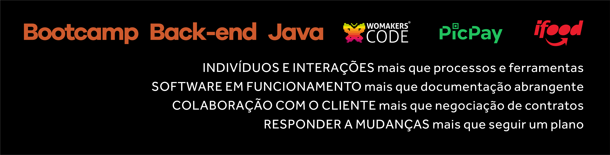

# Bootcamp de Java - Serviço de Agendamento de Meetups
<h1 align="center">
    
</h1>

 No Bootcamp de Java da WomakersCode estamos desenvolvendo microsserviços com Spring Boot e utilizando técnicas de desenvolvimento guiada por testes utilizando a metodologia do TDD. 
 

## Descrição do microsserviço: Serviço de Agendamento de Meetups

Consiste em um microserviço que disponibiliza as funcionalidades de criação e manutenção de meetups, e disponibiliza a possibilidade de usuários se registrarem nos meetups.

Este microsserviço está disponibilizado na Azure e possui as funcionalidades de criação de meetups, alteração de meetup, consulta de meetups e permite a exclusão de meetups.
Também está disponibilizada as funcionalidades de um usuário se registrar em um meetup, alterar uma inscrição, consultar uma inscrição, ou excluir uma inscrição que ele fez em um meetup.

### Regras de Negócio
- Um meetup pode conter várias incrições de usuários
- Vários usuários diferentes podem estar cadastrados em um meetup
- Não é possível consultar ou deletar um meetup que não existe
- Será devolvido erro quando tentar consultar um registro que não existe

## Índice

* [1. O que são microsserviços?](#microsserviços)
* [2. O que é TDD?](#tdd)
* [3. Tecnologias Utilizadas](#tecnologias)
* [4. Funcionalidades do microsserviço](#funcionalidades)
* [5. Swagger disponibilizado na Azure](#swagger)
* [6. Checklist das tarefas solicitadas no Bootcamp](#checklist)
* [7. Referências](#referencias)

## 1. O que são microsserviços?
Os microsserviços (ou a arquitetura de microsserviços) consistem em uma abordagem arquitetônica nativa de cloud na qual um único aplicativo é composto de muitos componentes ou serviços menores que são implementáveis de forma independente e têm acoplamento fraco.

## 2. O que é TDD?
TDD é uma sigla para Test Driven Development, ou Desenvolvimento Orientado a Testes. A ideia do TDD é que você trabalhe em ciclos.

- Primeiro, escreva um teste unitário que inicialmente irá falhar, tendo em vista que o código ainda não foi implementado;

- Crie o código que satisfaça esse teste, ou seja: implemente a funcionalidade em questão. Essa primeira implementação deverá satisfazer imediatamente o teste que foi escrito no ciclo anterior;
 
- Quando o código estiver implementado e o teste satisfeito, refatore o código para melhorar pontos como legibilidade. Logo após, execute o teste novamente. A nova versão do código também deverá passar sem que seja necessário modificar o teste escrito inicialmente.

<h1 align="center">
    
</h1>

## 3. Tecnologias Utilizadas
- Java 11
- Gradle
- Spring
- JPA
- TDD Test Driven Development
- Azure functions

## 4. Funcionalidades do microsserviço

#### Cadastrar um Meetup
- POST /api/meetups
- @RequestBody Example Value
  - {
    "date": "string",
    "event": "string",
    "ownerId": 1
    }

#### Buscar Meetup por ID
- GET /api/meetups/{id}

#### Buscar Meetup
- GET /api/meetups

#### Alteração de dados do Meetup
- PUT /api/meetups/{id}

#### Excluir Meetup
- DELETE /api/meetups/{id}

#### Registrar Agendamento de Meetup
- POST /api/registration
- @RequestBody Example Value
  - {
    "dateOfRegistration": "2022-05-06",
    "id": 0,
    "meetupId": 1,
    "name": "string",
    "personId": 1
    }

#### Buscar Registro por ID
- GET /api/registration/{id}
- 
#### Buscar Registro
- GET /api/registration

#### Alteração de dados do Registro
- PUT /api/registration/{id}

#### Excluir Registro
- DELETE /api/registration/{id}

## 5. Swagger
- [Link do Swagger](https://agendamento-meetup.azurewebsites.net/swagger-ui/#/)

## 6. Checklist das tarefas solicitadas no Bootcamp

## 👩‍💻 TODO list
- [X] Implementação da classe se servico
- [X] Testes no service
- [X] Implementação da classe de controlle da web
- [X] Testes de contrato no controller
- [X] Testes unitarios no repository
- [X] Implementação do repository
- [X] Swagger
- [X] Testes locais via postman
- [X] Deploy no azure

## 6. Referências
- [O que são Microsserviços](https://www.ibm.com/br-pt/cloud/learn/microservices)
- [O que é TDD](https://www.treinaweb.com.br/blog/afinal-o-que-e-tdd)

